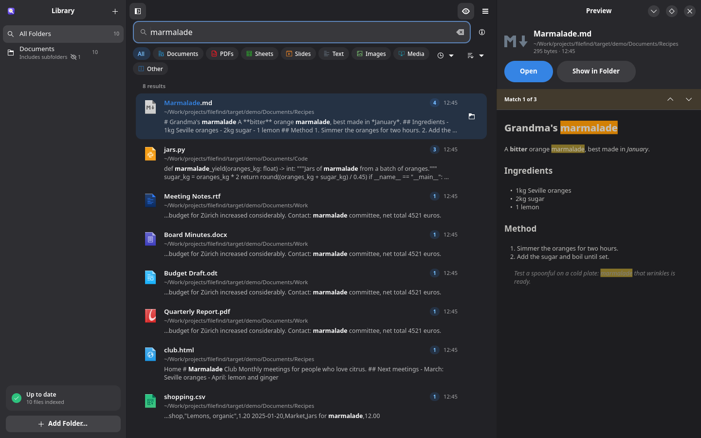
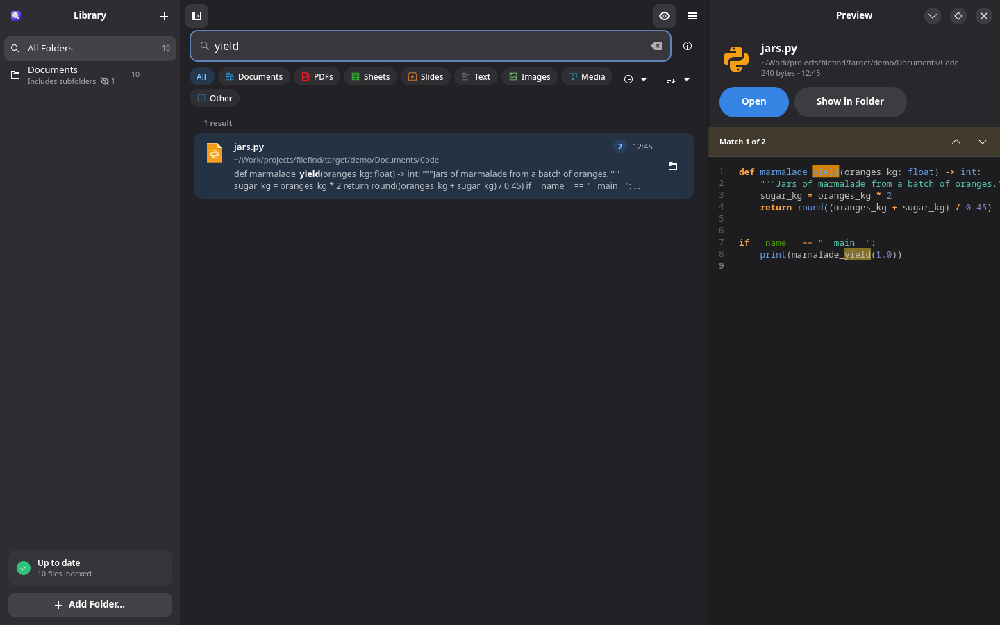
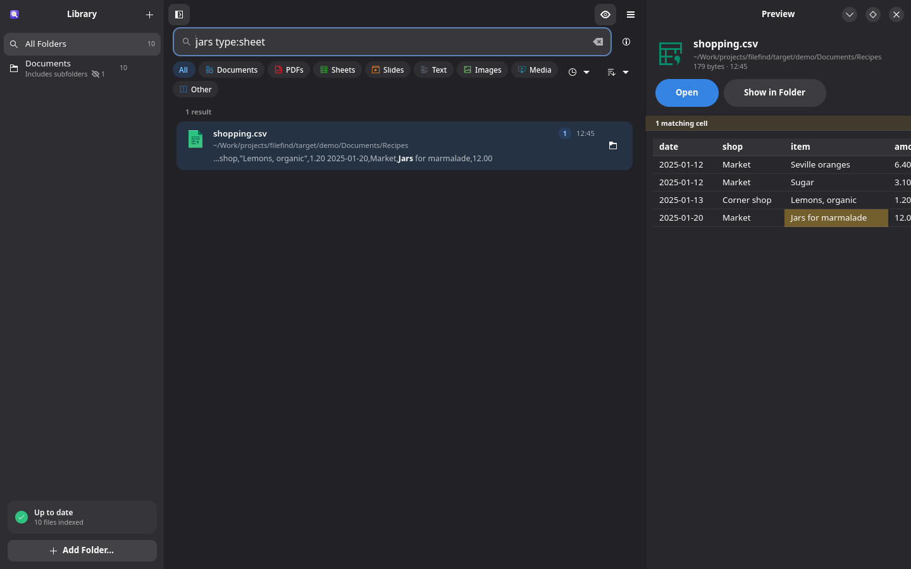
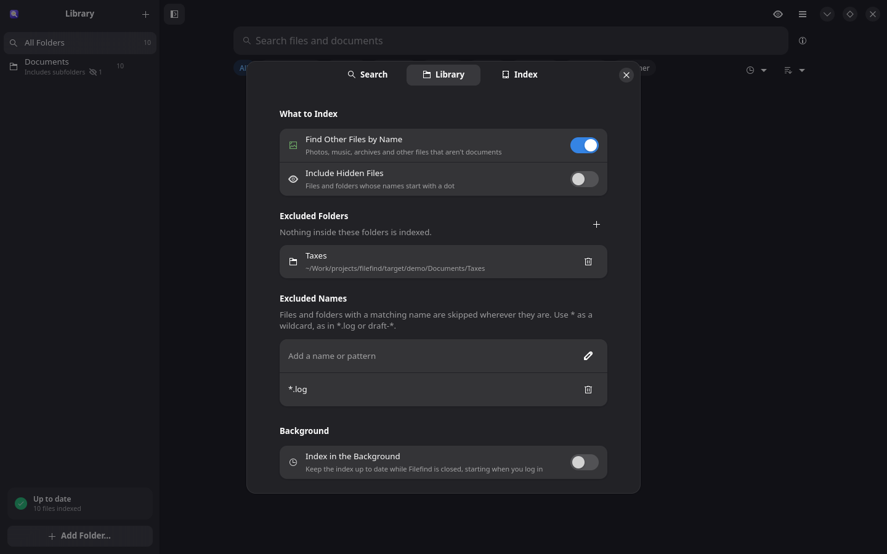

<div align="center">


# Filefind

**Find any file by what's inside it.**

Add the folders you care about and start typing. Filefind reads the text inside your
documents and shows matches as you type, even with typos.

> This app is coded with AI.



</div>

## Features

**Search**
- Full-text search inside PDF, Word (DOC, DOCX), LibreOffice (ODT, ODS, ODP), Excel (XLSX, XLS), PowerPoint (PPTX), RTF, EPUB, HTML, Markdown, plain text and source code
- Photos, music, archives and other files are found by name
- Tolerates typos and accents, matches words as you type them, and finds other forms of a word in English and Spanish (“invoices” finds “invoice”)
- Filter by type (Documents, PDFs, Sheets, Slides, Text, Images, Media, Other) and by date, and sort by relevance, date, name or size
- Each result shows how many times your words appear in it
- A small [search syntax](#search-syntax) for phrases, exclusions, file types, folders and names

**Preview**
- Press Space for a preview with every match highlighted, and step through the matches
- Code with syntax highlighting, spreadsheets and CSV files as tables, Markdown and web pages formatted, images shown as they are

**Library**
- Choose which folders to search, with or without their subfolders
- Exclude folders (like `~/Downloads/private`) and names or patterns (like `*.log`)
- Changes to your files are picked up while Filefind is open; optionally, keep indexing in the background and from login

**Desktop**
- Results in GNOME's search and in KDE's KRunner
- Works on GNOME and KDE Plasma, follows light and dark style
- English and Spanish, following the system language or chosen in Settings

**Considerate by design**
- Indexing only runs when your computer is otherwise idle, at the lowest CPU and disk priority
- PDFs, Word and spreadsheet files are read in separate helper processes with time and memory limits, so a damaged file can never crash or freeze the app
- Read-only access to your files; nothing leaves your computer

<table>
  <tr>
    <td></td>
    <td></td>
  </tr>
  <tr>
    <td align="center">Code, with syntax highlighting</td>
    <td align="center">Spreadsheets and CSV files as tables</td>
  </tr>
  <tr>
    <td colspan="2"></td>
  </tr>
  <tr>
    <td colspan="2" align="center">Settings: choose what gets indexed and what doesn't</td>
  </tr>
</table>

## Search syntax

| Type | To find |
|---|---|
| `budget report` | files with all of these words, anywhere |
| `"net total"` | this exact phrase |
| `invoice -draft` | files with “invoice” but not “draft” |
| `type:pdf` | one kind of file: `pdf`, `doc`, `sheet`, `slides`, `text`, `image`, `audio`, `video`, or an extension like `docx` |
| `in:taxes` | files in folders with this name |
| `name:invoice` | files with this word in their name |

Combine them freely, as in `invoice type:pdf in:2024 -draft`. Spanish keywords work too:
`tipo:`, `en:`, `nombre:`. The same list is in the app under Search Tips.

## Keyboard shortcuts

| Keys | Action |
|---|---|
| <kbd>Ctrl</kbd>+<kbd>F</kbd> | Focus the search field |
| <kbd>Enter</kbd> | Open the first result (or the selected one) |
| <kbd>↓</kbd> | Move from the search field to the results |
| <kbd>Space</kbd> | Show or hide the preview |
| <kbd>Ctrl</kbd>+<kbd>Enter</kbd> | Show the selected file in its folder |
| <kbd>Ctrl</kbd>+<kbd>C</kbd> | Copy the selected file's path |
| <kbd>F9</kbd> | Show or hide the library |
| <kbd>Ctrl</kbd>+<kbd>O</kbd> | Add a folder |
| <kbd>Ctrl</kbd>+<kbd>,</kbd> | Settings |

Results can also be dragged into other apps, and right-clicked for more actions.

## Install

Download `filefind-<version>-x86_64.flatpak` and its `.sha256` file from the
[latest release](../../releases/latest), check the download, and install it:

```sh
sha256sum -c filefind-*.flatpak.sha256
flatpak install --user filefind-*.flatpak
```

The GNOME runtime it needs is installed from Flathub if it isn't there already. Each
release also has a signed [build provenance attestation](../../attestations) showing it was
built by this repository's workflow from the release tag.

### From source


```sh
make setup     # once: the GNOME SDK, the Rust extension and flatpak-builder
make flatpak   # build and install for your user
```

`make bundle` produces `filefind.flatpak` and its checksum, a single file you can copy to
another computer and install with `flatpak install --user filefind.flatpak`.

### Publishing a release

The [Flatpak workflow](.github/workflows/flatpak.yml) tests and builds every push and pull
request; the bundle is attached to each run. To publish, bump the version in
`app/Cargo.toml` and describe the release in `data/io.github.filefind.Filefind.metainfo.xml`
(the workflow uses these notes for the GitHub release too), then push a matching tag:

```sh
git tag v0.2.0 && git push origin v0.2.0
```

The workflow checks the tag matches the version, then publishes the bundle, its SHA-256
checksum and a signed provenance attestation as a GitHub release.

### Permissions

Filefind can read (not change) your home folder and removable drives under `/media`,
`/run/media` and `/mnt`. It has no network access. Its index is kept with its other data
in `~/.var/app/io.github.filefind.Filefind/`.

## Development

Everything builds inside the GNOME Flatpak SDK, so the host only needs `flatpak`, plus
`cargo` for the core tests.

```sh
make dev          # build and run a debug version, with its own data in .dev/
make dev-es       # the same, in Spanish
make demo         # run on a demo library with a sample of every file type
make demo-reset   # start the demo from scratch
make test         # all tests
make check        # clippy
make screenshot   # render the demo window to a PNG (QUERY=..., PREVIEW=1, SETTINGS=library)
make              # list every command
```

`cargo run --release -p filefind-core --example bench -- <folder>` measures indexing speed.

The project is split in two crates:

- `core/`: the search engine. Text extraction, the [Tantivy](https://github.com/quickwit-oss/tantivy)
  index, the background indexer, the query syntax. No GUI dependencies, tested on its own.
- `app/`: the GTK 4 and libadwaita app, the preview, settings and the system search providers.

Other folders: `po/` holds the translations, `data/` the desktop files, icons, screenshots
and the demo samples, and `build-aux/` the Flatpak build helpers.

### Translations

To add a language, add its code to `po/LINGUAS` and to `LANGUAGES` in `app/src/i18n.rs`,
run `make po`, and translate `po/<code>.po`.

## License

[GPL-3.0-or-later](LICENSE).
